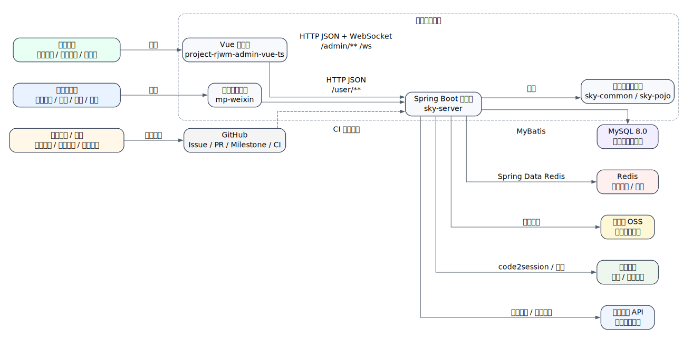
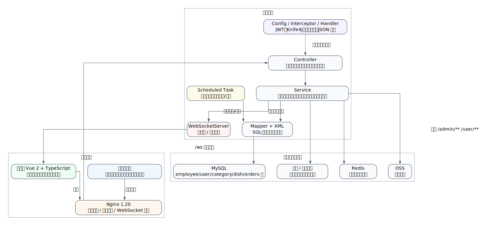
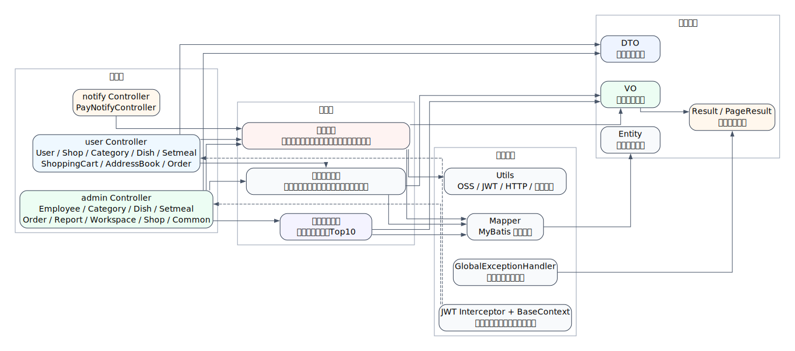
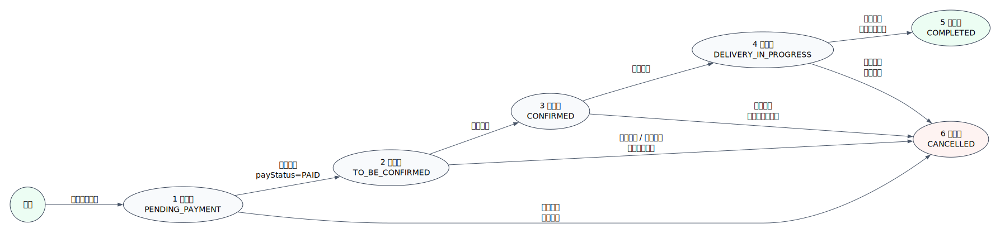
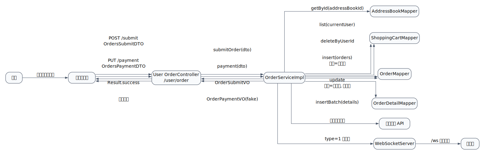
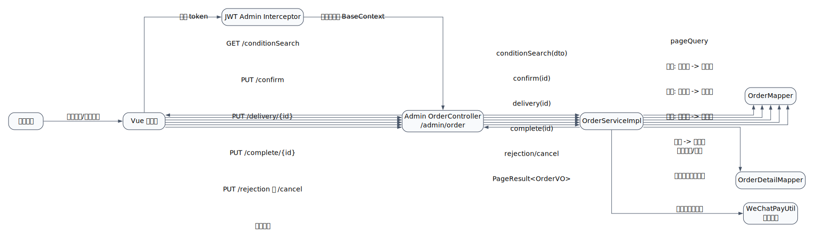
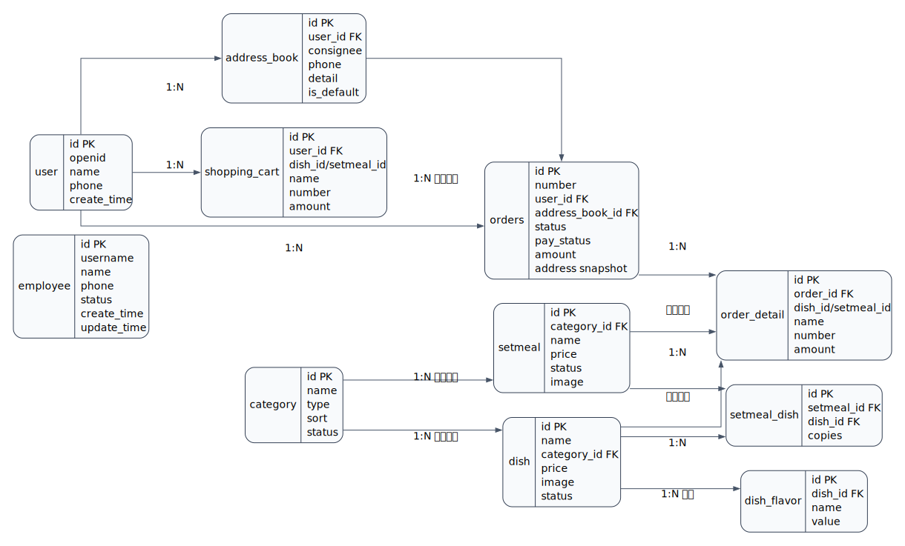
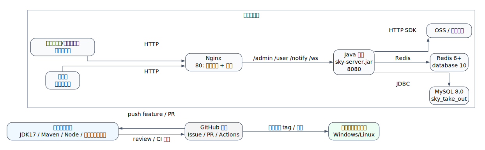
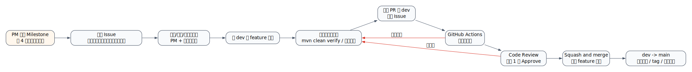

# 苍穹外卖项目设计文档

| 项目 | 内容 |
|---|---|
| 文档版本 | V1.0 |
| 编写日期 | 2026-07-01 |
| 项目名称 | 苍穹外卖 / 网上订餐系统 |
| 适用阶段 | Java + 智能体综合应用项目实训，4 周团队项目 |
| 团队规模 | 6 人 |
| 技术栈 | JDK 17、Spring Boot 2.7.3、MyBatis、MySQL 8.0、Redis、Vue 2、TypeScript、微信小程序、Nginx、WebSocket、Graphviz |
| 代码仓库 | `Xinyang-Hu123/Intern` |
| 关联文档 | `docs/requirements/需求设计文档.md`、`README.md` |

## 1. 文档目标

本文档是苍穹外卖项目的完整设计依据，面向项目经理、系统分析师、后端工程师、前端/小程序工程师、测试工程师和答辩评审老师。文档覆盖系统上下文、总体架构、模块设计、接口边界、数据模型、核心业务流程、部署拓扑、测试策略、团队协作和风险控制。

本文档与需求设计文档分工如下：

| 文档 | 重点 |
|---|---|
| `docs/requirements/需求设计文档.md` | 说明为什么做、做什么、验收什么，重点是需求、用例、范围、验收 |
| `docs/design/项目设计文档.md` | 说明怎么做、如何分层、如何联调、如何部署、如何测试，重点是技术设计和工程落地 |

## 2. 设计原则

| 原则 | 设计要求 |
|---|---|
| 前后端分离 | 管理端、小程序端只负责展示和交互，业务规则集中在服务端 |
| 分层清晰 | Controller 只做参数接收和分发，Service 承载业务规则，Mapper 负责数据访问 |
| 数据对象隔离 | DTO 接收请求，Entity 映射数据库，VO 返回前端，禁止直接把 Entity 暴露给前端 |
| 核心流程可追踪 | 下单、支付、接单、派送、完成、取消等状态变化必须可通过订单记录追踪 |
| 过程可协作 | 所有需求、任务、缺陷、PR、版本发布都通过 GitHub 过程化管理 |
| 演示可落地 | 系统设计以 4 周实训可完成、可演示、可答辩为边界，复杂外部能力保留扩展接口 |
| 图源可维护 | 所有设计图使用 Graphviz `.dot` 源文件维护，`.svg` 用于文档展示 |

## 3. 系统上下文设计

系统围绕“用户在线点餐”和“商家后台履约”两条主线建设。小程序用户完成浏览、加购、下单、支付、催单和历史订单查询；商家员工在管理端维护商品和处理订单；服务端统一处理鉴权、业务规则、数据持久化、缓存、文件上传、WebSocket 通知和外部服务集成。



### 3.1 参与者与职责

| 参与者 | 使用对象 | 核心目标 |
|---|---|---|
| 小程序用户 | 微信小程序 | 快速选餐、提交订单、支付、查看订单状态 |
| 商家员工 | Vue 管理端 | 维护菜品套餐、处理订单、查看经营数据 |
| 项目经理 | GitHub、文档、看板 | 控制需求范围、验收标准、进度和答辩材料 |
| 系统分析师 | 代码、接口、数据库、设计文档 | 把需求拆解为可实现的模块和技术方案 |
| 测试/配置管理员 | Issue、PR、CI、测试记录 | 确认功能质量、缺陷闭环和版本冻结 |
| 外部服务 | 微信、OSS、百度地图 | 提供登录、支付扩展、图片存储和配送范围校验能力 |

## 4. 总体架构设计

项目采用典型的三端分离结构：Vue 管理端、微信小程序端、Spring Boot 服务端。Nginx 作为静态资源服务器和反向代理，服务端通过 MyBatis 访问 MySQL，通过 Redis 存储店铺营业状态等轻量缓存，通过 WebSocket 向管理端实时推送新订单和催单。



### 4.1 代码目录与职责

| 目录 | 职责 | 说明 |
|---|---|---|
| `sky-take-out/` | 后端 Maven 多模块工程 | 父 POM 管理依赖和模块 |
| `sky-take-out/sky-common/` | 公共能力 | 常量、异常、工具类、统一结果、配置属性 |
| `sky-take-out/sky-pojo/` | 数据对象 | Entity、DTO、VO |
| `sky-take-out/sky-server/` | 后端主服务 | 启动类、Controller、Service、Mapper、配置、任务、WebSocket |
| `project-rjwm-admin-vue-ts/` | 管理端前端 | Vue 2 + TypeScript 页面、路由、接口封装 |
| `mp-weixin/` | 微信小程序端 | 小程序页面、组件、静态资源 |
| `nginx-1.20.2/` | Nginx 配置与静态产物 | 演示环境反向代理和管理端静态文件 |
| `docs/requirements/` | 需求文档 | 需求、用例、验收和需求图 |
| `docs/design/` | 设计文档 | 架构、模块、流程、部署和团队协作设计 |

### 4.2 技术选型

| 技术 | 用途 | 选型理由 |
|---|---|---|
| JDK 17 | 统一 Java 运行时 | 团队协作环境一致，满足课程要求 |
| Spring Boot 2.7.3 | 后端主框架 | 生态成熟，便于快速开发 REST API |
| MyBatis | 数据访问 | SQL 可控，适合课程项目展示数据库操作 |
| MySQL 8.0 | 业务数据存储 | 关系模型清晰，便于订单和商品数据建模 |
| Redis | 缓存/状态 | 适合店铺营业状态等快速读写场景 |
| Vue 2 + TypeScript | 管理端 | 已有代码基础稳定，便于维护后台页面 |
| 微信小程序 | 用户端 | 符合移动点餐场景 |
| Nginx | 静态资源和代理 | 统一管理前端静态资源、接口代理和 WebSocket 转发 |
| WebSocket | 实时提醒 | 新订单、催单能及时推送到管理端 |
| Knife4j | 接口文档 | 方便联调和答辩展示接口 |
| Graphviz | 设计图 | 图源可版本化，适合 GitHub 协作 |

## 5. 后端分层与组件设计

后端分为接口层、业务层、数据访问层、领域对象层和基础设施层。接口层根据访问端拆分为 `admin`、`user`、`notify` 三类 Controller；业务层根据业务模块拆分 Service；数据访问层使用 Mapper 接口和 XML SQL。



### 5.1 接口层设计

| 包/模块 | 代表类 | 设计说明 |
|---|---|---|
| `controller.admin` | `EmployeeController`、`DishController`、`OrderController`、`ReportController` | 管理端接口统一以 `/admin` 开头，受管理端 JWT 拦截器保护 |
| `controller.user` | `UserController`、`ShoppingCartController`、`AddressBookController`、`OrderController` | 用户端接口统一以 `/user` 开头，受用户端 JWT 拦截器保护 |
| `controller.notify` | `PayNotifyController` | 支付回调等外部通知入口 |
| `handler` | `GlobalExceptionHandler` | 捕获业务异常和 SQL 唯一约束异常，统一返回 `Result` |
| `config` | `WebMvcConfiguration` | 注册 JWT 拦截器、Knife4j、静态资源映射和 JSON 转换器 |

### 5.2 业务层设计

| 服务 | 关键职责 | 设计关注点 |
|---|---|---|
| `EmployeeService` | 员工登录、员工增改查、启停 | 密码校验、账号状态、默认密码策略 |
| `CategoryService` | 分类新增、分页、修改、删除、启停 | 删除前检查菜品/套餐引用 |
| `DishService` | 菜品、口味、图片、售卖状态 | 菜品和口味批量保存，关联套餐时删除受限 |
| `SetmealService` | 套餐及套餐菜品关系 | 启售前检查套餐内菜品状态 |
| `ShoppingCartService` | 加购、减少、列表、清空 | 同商品同规格数量合并，用户隔离 |
| `AddressBookService` | 地址增删改查、默认地址 | 同一用户仅一个默认地址 |
| `OrderService` | 下单、支付、取消、履约、催单、再来一单 | 状态机、订单明细、购物车清空、退款、WebSocket |
| `WorkspaceService` | 工作台统计 | 今日数据、订单概览、菜品和套餐概览 |
| `ReportService` | 营业额、用户、订单、销量统计、导出 | 日期区间聚合、Excel 导出 |

### 5.3 数据访问层设计

| Mapper | 数据对象 | 典型操作 |
|---|---|---|
| `EmployeeMapper` | `employee` | 登录查询、分页、新增、更新状态 |
| `CategoryMapper` | `category` | 分类 CRUD、按类型查询 |
| `DishMapper`、`DishFlavorMapper` | `dish`、`dish_flavor` | 菜品分页、批量口味、状态更新 |
| `SetmealMapper`、`SetmealDishMapper` | `setmeal`、`setmeal_dish` | 套餐分页、套餐菜品关系 |
| `ShoppingCartMapper` | `shopping_cart` | 加购、减少、按用户清空、批量插入 |
| `AddressBookMapper` | `address_book` | 地址维护、默认地址 |
| `OrderMapper`、`OrderDetailMapper` | `orders`、`order_detail` | 订单分页、状态统计、订单明细 |
| `UserMapper` | `user` | 微信登录用户查询与新增 |

## 6. 核心业务流程设计

### 6.1 订单状态机

订单是系统最核心的业务对象。订单状态只能按定义好的路径流转，任何越级变更都应被业务层拦截。当前代码中订单状态常量定义在 `Orders` 实体中，分别为待付款、待接单、已接单、派送中、已完成、已取消。



| 状态 | 值 | 业务含义 | 可执行动作 |
|---|---:|---|---|
| 待付款 | 1 | 用户已提交订单但未支付 | 支付、用户取消 |
| 待接单 | 2 | 用户已支付，等待商家确认 | 商家接单、商家拒单、用户取消、催单 |
| 已接单 | 3 | 商家已确认订单 | 派送、商家取消 |
| 派送中 | 4 | 订单正在配送 | 完成、商家取消 |
| 已完成 | 5 | 订单履约完成 | 查询、统计、再来一单 |
| 已取消 | 6 | 订单终止 | 查询、统计 |

### 6.2 用户下单与支付流程

用户下单流程需要同时保证业务校验和数据一致性：校验地址、配送范围和购物车，创建订单主表，批量创建订单明细，清空购物车，并在支付成功后推送管理端提醒。



关键设计：

| 步骤 | 设计要求 |
|---|---|
| 地址校验 | 地址必须存在，并属于当前用户 |
| 配送范围 | 使用店铺地址和用户地址调用百度地图接口，超过配送范围时阻止下单 |
| 购物车校验 | 当前用户购物车不能为空 |
| 订单创建 | 订单主表保存用户、金额、地址快照、状态、支付状态、下单时间 |
| 明细创建 | 订单明细从购物车复制，保留名称、图片、金额等历史信息 |
| 购物车清理 | 订单创建成功后清理当前用户购物车 |
| 支付处理 | 当前实现为模拟支付，直接把订单置为待接单和已支付 |
| 实时通知 | 支付成功后通过 WebSocket 推送 `type=1` 新订单消息 |

### 6.3 管理端订单履约流程

管理端订单流程围绕订单列表、详情、接单、拒单、取消、派送、完成展开。所有管理端请求需要携带 `token`，通过 `JwtTokenAdminInterceptor` 校验后再进入 Controller。



| 动作 | 接口 | 前置状态 | 后置状态 | 规则 |
|---|---|---|---|---|
| 条件查询 | `GET /admin/order/conditionSearch` | 已登录 | 不改变 | 支持状态、时间、订单号等条件 |
| 接单 | `PUT /admin/order/confirm` | 待接单 | 已接单 | 仅待接单可接单 |
| 拒单 | `PUT /admin/order/rejection` | 待接单 | 已取消 | 已支付订单应退款并记录拒单原因 |
| 取消 | `PUT /admin/order/cancel` | 履约中订单 | 已取消 | 已支付订单应退款并记录取消原因 |
| 派送 | `PUT /admin/order/delivery/{id}` | 已接单 | 派送中 | 仅已接单可派送 |
| 完成 | `PUT /admin/order/complete/{id}` | 派送中 | 已完成 | 记录送达时间 |

### 6.4 基础资料流程

| 模块 | 主流程 | 关键约束 |
|---|---|---|
| 员工 | 新增员工 -> 分页查询 -> 编辑 -> 启停 | 用户名唯一，禁用员工不可登录 |
| 分类 | 新增分类 -> 分页查询 -> 编辑 -> 启停/删除 | 被菜品或套餐引用时禁止删除 |
| 菜品 | 新增菜品与口味 -> 上传图片 -> 启售 -> 用户端展示 | 关联套餐时删除受限，停售菜品不可购买 |
| 套餐 | 新增套餐并选择菜品 -> 启售 -> 用户端展示 | 套餐内有停售菜品时不应启售 |
| 店铺状态 | 管理端设置营业/打烊 -> 用户端查询 | 打烊时用户端应禁止提交新订单 |

## 7. 数据模型设计

项目采用关系型数据模型。用户、地址、购物车、订单、订单明细构成用户下单主链路；分类、菜品、口味、套餐、套餐菜品关系构成商品管理主链路；员工支撑管理端登录和后台操作。



### 7.1 核心实体设计

| 实体 | 业务含义 | 设计说明 |
|---|---|---|
| `employee` | 管理端员工 | 保存账号、密码、手机号、状态和审计字段 |
| `user` | 小程序用户 | 通过微信 openid 识别用户 |
| `category` | 商品分类 | `type` 区分菜品分类和套餐分类 |
| `dish` | 菜品 | 关联分类，保存价格、图片、描述、售卖状态 |
| `dish_flavor` | 菜品口味 | 一个菜品可有多个口味配置 |
| `setmeal` | 套餐 | 关联分类，保存价格、图片、售卖状态 |
| `setmeal_dish` | 套餐菜品关系 | 多对多关系拆分表，保存菜品份数 |
| `shopping_cart` | 购物车 | 保存用户临时加购项，可指向菜品或套餐 |
| `address_book` | 地址簿 | 保存用户收货地址和默认地址状态 |
| `orders` | 订单主表 | 保存订单状态、支付状态、金额、地址快照和履约时间 |
| `order_detail` | 订单明细 | 保存订单内每个菜品/套餐的历史快照 |

### 7.2 数据一致性要求

| 场景 | 一致性要求 |
|---|---|
| 下单 | 订单主表、订单明细、购物车清理应作为一个业务整体处理 |
| 菜品新增/编辑 | 菜品基本信息和口味信息保持同步 |
| 套餐新增/编辑 | 套餐基本信息和套餐菜品关系保持同步 |
| 默认地址 | 同一用户只能有一个默认地址 |
| 订单取消/拒单 | 订单状态、取消/拒单原因、取消时间、退款状态保持一致 |
| 报表统计 | 仅统计有效订单，取消订单不应进入营业额 |

## 8. 接口设计

### 8.1 统一响应

后端接口统一返回 `Result<T>` 或 `PageResult`。成功返回业务数据，失败由全局异常处理器返回错误消息。分页接口返回总数和列表，便于前端分页组件直接使用。

### 8.2 管理端接口分组

| 分组 | 路径 | 主要能力 |
|---|---|---|
| 员工 | `/admin/employee` | 登录、退出、新增、分页、启停、详情、编辑 |
| 分类 | `/admin/category` | 新增、分页、删除、编辑、启停、列表 |
| 菜品 | `/admin/dish` | 新增、分页、删除、详情、编辑、列表、启停 |
| 套餐 | `/admin/setmeal` | 新增、分页、删除、详情、编辑、启停 |
| 订单 | `/admin/order` | 条件查询、统计、详情、接单、拒单、取消、派送、完成 |
| 报表 | `/admin/report` | 营业额、用户、订单、Top10、导出 |
| 工作台 | `/admin/workspace` | 今日数据、订单概览、菜品概览、套餐概览 |
| 店铺 | `/admin/shop` | 设置营业状态、查询营业状态 |
| 通用 | `/admin/common` | 图片上传 |

### 8.3 用户端接口分组

| 分组 | 路径 | 主要能力 |
|---|---|---|
| 用户 | `/user/user` | 微信登录 |
| 店铺 | `/user/shop` | 店铺状态、店铺信息 |
| 分类 | `/user/category` | 分类列表 |
| 菜品 | `/user/dish` | 按分类查询菜品 |
| 套餐 | `/user/setmeal` | 套餐列表、套餐菜品 |
| 购物车 | `/user/shoppingCart` | 添加、减少、列表、清空 |
| 地址簿 | `/user/addressBook` | 新增、列表、详情、编辑、默认地址、删除 |
| 订单 | `/user/order` | 提交、支付、历史订单、详情、取消、再来一单、催单 |
| 支付通知 | `/notify/paySuccess` | 支付成功回调 |

### 8.4 鉴权设计

| 访问端 | 请求头 | 拦截范围 | 放行接口 |
|---|---|---|---|
| 管理端 | `token` | `/admin/**` | `/admin/employee/login` |
| 用户端 | `authentication` | `/user/**` | `/user/user/login`、`/user/shop/status` |

JWT 解析成功后，拦截器把当前员工或用户 id 写入 `BaseContext`。Service 层通过当前 id 限制用户只能操作自己的购物车、地址和订单。

## 9. 部署设计

系统可以在开发本机或演示服务器部署。后端以 jar 包运行，管理端打包为静态文件交给 Nginx，微信小程序通过微信开发者工具预览或上传。



### 9.1 环境要求

| 组件 | 推荐版本 | 说明 |
|---|---|---|
| JDK | 17 | 团队统一运行时版本 |
| Maven | 3.6+ | 后端构建 |
| MySQL | 8.0 | 数据库名 `sky_take_out` |
| Redis | 6+ | 店铺状态等缓存 |
| Node.js | 14/16 | 管理端前端依赖较旧，建议团队统一版本 |
| Nginx | 1.20+ | 静态资源和反向代理 |
| 微信开发者工具 | 当前稳定版 | 小程序预览和上传 |

### 9.2 配置项

| 文件 | 关键配置 |
|---|---|
| `sky-take-out/sky-server/src/main/resources/application.yml` | 端口、MyBatis、JWT、OSS、微信、店铺地址、百度地图 AK |
| `sky-take-out/sky-server/src/main/resources/application-dev.yml` | MySQL、Redis、OSS、微信支付等环境变量 |
| `project-rjwm-admin-vue-ts/.env.production` | 后端 API 地址、WebSocket 地址 |
| `nginx-1.20.2/conf/nginx.conf` | 静态资源目录、`/api`、`/user`、`/ws` 代理 |

## 10. 测试设计

### 10.1 测试层级

| 层级 | 目标 | 重点 |
|---|---|---|
| 单元测试 | 验证 Service 业务规则 | 订单状态流转、购物车、地址、分类删除限制 |
| 接口测试 | 验证 Controller 到 Service 的契约 | 登录、分页、下单、支付、接单、报表 |
| 联调测试 | 验证前后端字段和状态一致 | token、分页字段、图片上传、WebSocket |
| 端到端测试 | 验证演示主链路 | 管理端上架商品 -> 小程序下单 -> 管理端履约 |
| 回归测试 | 防止核心流程被新改动破坏 | 每次合入前回归下单主流程 |

### 10.2 核心测试用例

| 编号 | 用例 | 预期 |
|---|---|---|
| T-001 | 管理员正确账号密码登录 | 返回 token 和员工信息 |
| T-002 | 禁用员工登录 | 返回失败提示 |
| T-003 | 新增菜品并启售 | 用户端同分类可查询到菜品 |
| T-004 | 用户购物车添加同一商品两次 | 数量累加，金额正确 |
| T-005 | 用户无地址提交订单 | 返回地址为空异常 |
| T-006 | 用户购物车为空提交订单 | 返回购物车为空异常 |
| T-007 | 用户成功提交并支付订单 | 订单变为待接单，管理端收到 WebSocket 提醒 |
| T-008 | 商家接单、派送、完成 | 状态依次为已接单、派送中、已完成 |
| T-009 | 商家拒单已支付订单 | 订单取消，记录拒单原因，触发退款扩展 |
| T-010 | 用户催单 | 管理端收到 `type=2` 催单提醒 |
| T-011 | 再来一单 | 原订单明细复制到当前用户购物车 |
| T-012 | 报表查询指定日期范围 | 返回营业额、订单、用户、Top10 数据 |

### 10.3 合入前检查

后端改动：

```bash
cd sky-take-out
mvn clean verify
```

管理端改动：

```bash
cd project-rjwm-admin-vue-ts
npm run lint
npm run test:unit
```

如果前端老依赖导致检查无法在本地稳定运行，PR 必须说明原因，并附上页面截图、接口联调记录或手工测试记录。

## 11. 团队协作设计

团队 6 人分工与 `README.md` 中协作规范一致：PM、系统分析师/技术负责人、后端工程师 A、后端工程师 B、前端/小程序工程师、测试/配置管理员。所有需求、缺陷和任务通过 GitHub Issue 管理，所有代码通过 feature 分支和 PR 合入。



### 11.1 分支策略

| 分支 | 用途 | 规则 |
|---|---|---|
| `main` | 阶段发布和最终答辩版本 | 只接受 `dev` 的发布 PR |
| `dev` | 团队集成主干 | 只接受 feature 分支 PR |
| `feature/姓名-功能` | 个人开发分支 | 开发成员可自由 push，合入后删除 |

### 11.2 Issue 与 PR 要求

| 类型 | 要求 |
|---|---|
| Issue | 写清业务目标、验收标准、负责人、截止时间、影响模块 |
| Commit | 使用 `类型(模块): #Issue编号 描述` |
| PR | base 选择 `dev`，关联 Issue，填写做了什么、自测结果、影响范围 |
| Review | 至少 1 人 Approve，跨模块变更需 PM 或测试参与验收 |
| 合并 | CI 通过后使用 Squash and merge |

### 11.3 4 周里程碑对齐

| 阶段 | 交付重点 | 本文档支撑章节 |
|---|---|---|
| 第 1 周：需求与设计 | 需求、原型、架构、数据库、接口草案 | 1-8 章 |
| 第 2 周：环境与核心功能 | 后端运行、核心接口、管理端/小程序主链路 | 4-8 章 |
| 第 3 周：业务功能开发 | 商品、订单、报表、WebSocket、联调 | 5-10 章 |
| 第 4 周：整合答辩 | 测试、部署、文档、PPT、演示版本 | 9-12 章 |

## 12. 风险与改进建议

| 风险 | 当前表现 | 建议处理 |
|---|---|---|
| 订单完成逻辑需复核 | `complete` 流程应把订单置为已完成并记录送达时间 | 后续增加单元测试，修正状态更新和 id 赋值 |
| 配送范围解析需复核 | 地址解析和路线规划依赖百度地图 API，异常场景较多 | 增加外部接口失败降级和测试桩 |
| 下单事务边界需加强 | 下单涉及订单、明细、购物车三类写操作 | 给下单流程补充事务，避免部分成功 |
| 外部服务凭证缺失 | OSS、微信、百度 AK 均为占位符 | 演示前统一配置测试凭证或准备模拟方案 |
| 前端依赖较旧 | Node 版本不一致可能导致安装失败 | 团队统一 Node 14/16，并记录可运行版本 |
| 数据库初始化材料不足 | 若缺少 SQL 脚本，新成员启动困难 | 补充 `docs/deploy` 或 `sql` 初始化脚本 |
| 文档与代码漂移 | 需求、接口、状态流转可能持续变化 | 每个 PR 若改接口/表结构，必须同步文档 |

## 13. 答辩展示建议

答辩时建议按以下顺序演示：

1. 项目背景和业务目标：说明餐饮门店外卖管理痛点。
2. 系统架构：展示系统上下文图和容器组件图。
3. 数据模型：展示 ER 图，说明商品、购物车、订单之间的关系。
4. 核心流程：展示订单状态机、用户下单时序图、管理端履约时序图。
5. 功能演示：管理端上架菜品，小程序加购下单，管理端接单派送完成。
6. 工程协作：展示 GitHub Issue、PR、Milestone 和团队协作流程图。
7. 测试与风险：说明已测场景、已知风险和后续改进。

## 14. Graphviz 图源说明

本文档图表源文件统一存放在 `docs/design/diagrams/`：

| 图 | 源文件 | 输出 |
|---|---|---|
| 系统上下文图 | `01_system_context.dot` | `01_system_context.svg` |
| 容器与组件图 | `02_container_component.dot` | `02_container_component.svg` |
| 后端分层组件图 | `03_backend_layered_components.dot` | `03_backend_layered_components.svg` |
| 订单状态机 | `04_order_state_machine.dot` | `04_order_state_machine.svg` |
| 用户下单与支付时序图 | `05_user_order_sequence.dot` | `05_user_order_sequence.svg` |
| 管理端履约时序图 | `06_admin_fulfillment_sequence.dot` | `06_admin_fulfillment_sequence.svg` |
| 数据库 ER 图 | `07_database_er.dot` | `07_database_er.svg` |
| 部署拓扑图 | `08_deployment_topology.dot` | `08_deployment_topology.svg` |
| 团队协作流程图 | `09_team_workflow.dot` | `09_team_workflow.svg` |

重新生成 SVG：

```bash
cd docs/design/diagrams
dot -Tsvg 01_system_context.dot -o 01_system_context.svg
dot -Tsvg 02_container_component.dot -o 02_container_component.svg
dot -Tsvg 03_backend_layered_components.dot -o 03_backend_layered_components.svg
dot -Tsvg 04_order_state_machine.dot -o 04_order_state_machine.svg
dot -Tsvg 05_user_order_sequence.dot -o 05_user_order_sequence.svg
dot -Tsvg 06_admin_fulfillment_sequence.dot -o 06_admin_fulfillment_sequence.svg
dot -Tsvg 07_database_er.dot -o 07_database_er.svg
dot -Tsvg 08_deployment_topology.dot -o 08_deployment_topology.svg
dot -Tsvg 09_team_workflow.dot -o 09_team_workflow.svg
```
