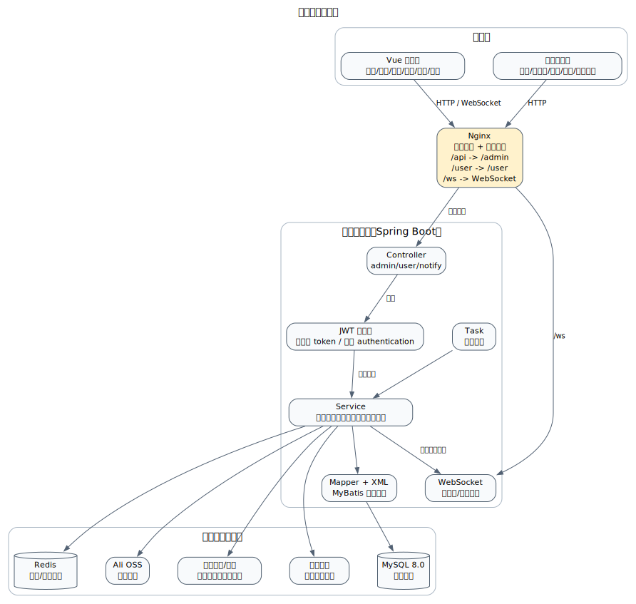
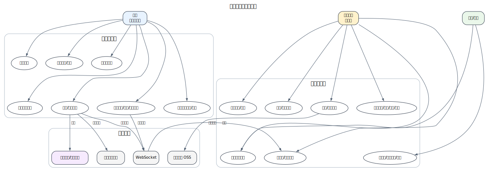
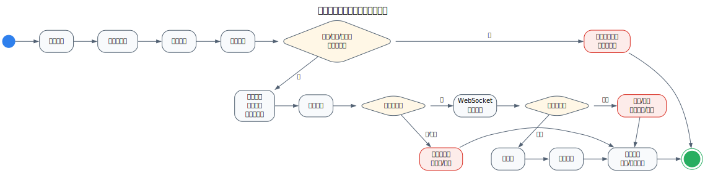
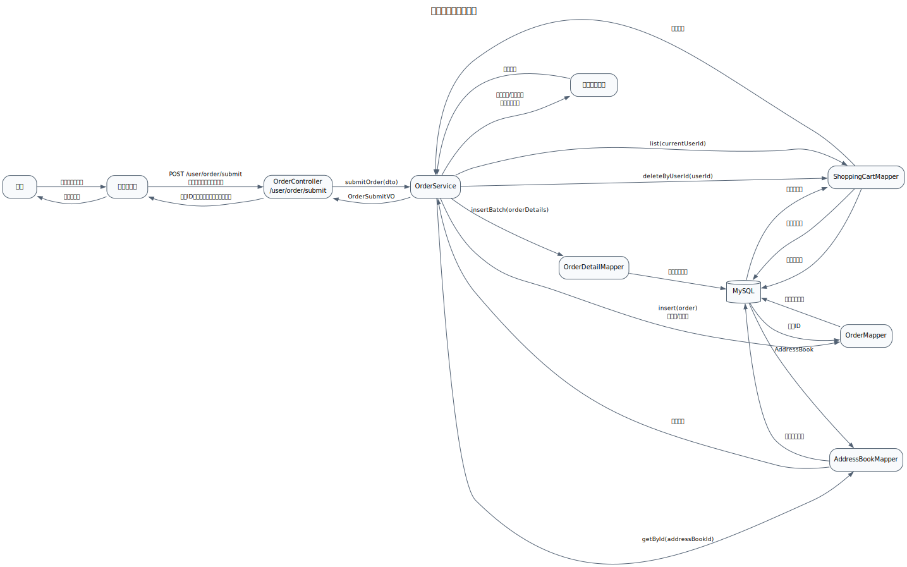
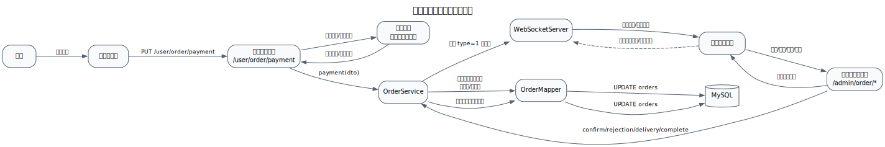
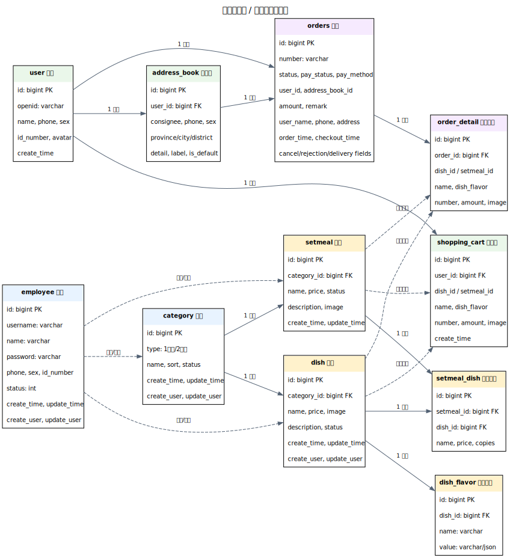

# 苍穹外卖系统需求设计文档

| 项目 | 内容 |
|---|---|
| 文档版本 | V1.0 |
| 编写日期 | 2026-06-30 |
| 适用阶段 | 4 周 Java + 智能体综合应用项目实训 |
| 项目名称 | 苍穹外卖 / 网上订餐系统 |
| 技术栈 | Java 17、Spring Boot 2.7.3、MyBatis、MySQL 8.0、Redis、Vue 2、微信小程序、Nginx、WebSocket |
| 文档用途 | 中期检查、详细设计、项目答辩和团队协作验收 |

## 1. 文档目标

本文档面向项目经理、系统分析师、开发工程师、测试工程师和评审老师，描述苍穹外卖系统的业务目标、用户需求、功能范围、业务流程、核心交互、数据模型、接口边界、非功能需求和验收标准。

本文档不是单纯的代码说明，而是团队在 4 周实训周期内进行需求确认、任务拆分、开发联调、测试验收和答辩汇报的统一依据。后续功能变更必须以 GitHub Issue 记录，并同步更新本文档或相关图源。

## 2. 项目背景

餐饮门店在外卖经营中通常需要同时处理菜品维护、套餐配置、用户下单、订单履约、营业状态、数据统计和新订单提醒等工作。传统手工处理方式容易出现订单遗漏、状态不一致、数据统计不及时、前后台协作低效等问题。

苍穹外卖系统面向餐饮门店构建一套完整的线上订餐解决方案，包含管理端、用户端和服务端三部分：

- 管理端：供商家员工维护菜品、套餐、分类、订单和经营数据。
- 用户端：通过微信小程序完成浏览、购物车、地址管理、下单、支付和历史订单查询。
- 服务端：提供统一业务接口、鉴权、数据持久化、缓存、WebSocket 通知和外部服务集成。

## 3. 项目目标

### 3.1 业务目标

- 支持用户在小程序端完成从浏览菜品到下单支付的完整闭环。
- 支持商家在管理端维护基础数据、处理订单和查看经营数据。
- 支持订单状态的完整流转，降低漏单、错单和状态不一致风险。
- 支持新订单和催单通过 WebSocket 实时提醒管理端。
- 支持团队在实训中完成需求分析、系统设计、开发、测试、部署和答辩的完整软件工程流程。

### 3.2 产品目标

- 用户端流程清晰，用户可快速完成选餐、下单、支付和查看订单。
- 管理端功能按业务模块组织，便于门店员工日常操作。
- 订单处理链路透明，关键状态可追踪、可统计、可回溯。
- 系统设计与代码结构保持一致，便于团队分工开发和评审说明。

### 3.3 实训目标

- 完成需求分析、概要设计、详细设计、核心代码、中期检查和最终答辩材料。
- 通过 GitHub Milestone、Issue、PR 和 Review 管理团队协作过程。
- 输出可维护的 Graphviz 图源文件，支持后续持续修订。

## 4. 角色与干系人

| 角色 | 使用端 | 主要诉求 | 关键权限 |
|---|---|---|---|
| 用户 | 微信小程序 | 浏览商品、维护地址、下单支付、查看订单 | 用户登录、购物车、订单、地址簿 |
| 商家员工 | Vue 管理端 | 处理订单、维护菜品套餐、接收提醒 | 管理端登录、订单处理、基础数据维护 |
| 店长/运营 | Vue 管理端 | 查看经营数据、控制营业状态 | 工作台、报表、营业状态 |
| 系统管理员 | Vue 管理端 | 维护员工账号和权限基础数据 | 员工管理、状态启停 |
| 测试/配置管理员 | GitHub + 本地环境 | 确保功能正确、版本可追踪 | Issue、PR、CI、测试记录 |
| 项目经理 | GitHub + 文档 | 控制范围、节奏、交付物和答辩 | Milestone、验收标准、交付物确认 |

## 5. 术语表

| 术语 | 说明 |
|---|---|
| 管理端 | 商家使用的 Vue 后台管理系统 |
| 用户端 | 微信小程序端，面向下单用户 |
| 菜品 | 可单独售卖的商品，支持口味配置 |
| 套餐 | 由多个菜品组合形成的商品 |
| 购物车 | 用户下单前临时保存的商品集合 |
| 订单 | 用户提交并支付后由商家履约的业务单据 |
| 订单明细 | 订单中的菜品或套餐条目 |
| 待付款 | 订单已创建但未支付 |
| 待接单 | 用户已支付，等待商家确认 |
| 已接单 | 商家已确认订单，等待派送 |
| 派送中 | 订单正在配送 |
| 已完成 | 订单履约完成 |
| 已取消 | 用户、商家或系统原因取消订单 |

## 6. 系统范围

### 6.1 范围内功能

| 端 | 功能模块 | 范围说明 |
|---|---|---|
| 管理端 | 员工管理 | 登录、退出、新增员工、分页查询、状态启停、编辑员工 |
| 管理端 | 分类管理 | 新增、分页查询、编辑、删除、启停、按类型查询 |
| 管理端 | 菜品管理 | 新增、分页查询、编辑、删除、启停、图片上传、口味维护 |
| 管理端 | 套餐管理 | 新增、分页查询、编辑、删除、启停、套餐菜品维护 |
| 管理端 | 订单管理 | 条件查询、详情、接单、拒单、取消、派送、完成、统计 |
| 管理端 | 工作台 | 营业数据、订单概览、菜品概览、套餐概览 |
| 管理端 | 数据统计 | 营业额、用户、订单、销量 Top10、报表导出 |
| 管理端 | 店铺管理 | 营业状态查询与设置 |
| 管理端 | 通知提醒 | 新订单和催单 WebSocket 提醒 |
| 用户端 | 微信登录 | 通过微信身份换取系统用户 token |
| 用户端 | 商品浏览 | 分类、菜品、套餐、套餐菜品、店铺状态、店铺信息 |
| 用户端 | 购物车 | 添加、减少、查询、清空购物车 |
| 用户端 | 地址簿 | 新增、查询、编辑、删除、设置默认地址 |
| 用户端 | 下单支付 | 提交订单、支付、支付成功后通知商家 |
| 用户端 | 历史订单 | 分页查询、订单详情、取消、催单、再来一单 |

### 6.2 范围外功能

| 功能 | 当前处理方式 |
|---|---|
| 真实配送员端 | 不单独建设，由商家在管理端维护订单派送状态 |
| 真实支付闭环 | 当前代码中支付为模拟实现，保留微信支付工具类和回调接口 |
| 精细化权限 RBAC | 现阶段以员工登录和基础 token 鉴权为主 |
| AI 智能体深度业务闭环 | 作为扩展方向，可围绕客服问答、菜品推荐和订单咨询继续建设 |

## 7. 总体架构设计

系统采用前后端分离架构。管理端和小程序端通过 HTTP 调用 Spring Boot 服务，Nginx 负责静态资源和反向代理。服务端按 Controller、Service、Mapper 分层，使用 MyBatis 访问 MySQL，使用 Redis 支撑缓存和营业状态，使用 WebSocket 向管理端推送订单事件。

### 7.1 分层职责

| 层级 | 主要组件 | 职责 |
|---|---|---|
| 表现层 | Vue 管理端、微信小程序 | 页面展示、用户操作、接口调用、错误提示 |
| 网关/代理层 | Nginx | 静态资源托管、接口转发、WebSocket 转发 |
| 接口层 | Controller | 参数接收、鉴权后分发、统一响应 |
| 业务层 | Service | 业务规则、状态流转、跨表操作、外部服务调用 |
| 数据访问层 | Mapper/XML | SQL 查询、分页、批量插入、状态更新 |
| 基础设施 | MySQL、Redis、OSS、WebSocket、地图服务 | 数据持久化、缓存、图片存储、实时通知、配送范围校验 |

## 8. 用例设计

### 8.1 用户端用例

| 用例 | 参与者 | 前置条件 | 主成功场景 | 异常场景 |
|---|---|---|---|---|
| 微信登录 | 用户 | 用户打开小程序 | 获取微信 code，调用登录接口，生成用户 token | 微信 code 无效、后端登录失败 |
| 浏览商品 | 用户 | 店铺可访问 | 查询分类、菜品、套餐，展示商品详情 | 店铺打烊、分类为空、图片加载失败 |
| 维护购物车 | 用户 | 已登录 | 添加菜品/套餐，增减数量，查询或清空购物车 | 商品停售、库存/状态异常、购物车为空 |
| 管理地址 | 用户 | 已登录 | 新增、编辑、删除地址，设置默认地址 | 地址字段缺失、默认地址不存在 |
| 提交订单 | 用户 | 已登录且购物车非空 | 选择地址，提交订单，生成待付款订单和明细 | 地址为空、超出配送范围、购物车为空 |
| 支付订单 | 用户 | 订单待付款 | 完成支付，订单转为待接单，商家收到提醒 | 支付失败、订单不存在、重复支付 |
| 查询历史订单 | 用户 | 已登录 | 按状态分页查询订单和明细 | 无订单、订单详情不存在 |
| 催单/再来一单 | 用户 | 已登录且订单存在 | 催单触发商家提醒；再来一单复制明细到购物车 | 订单不存在、商品已停售 |

### 8.2 管理端用例

| 用例 | 参与者 | 前置条件 | 主成功场景 | 异常场景 |
|---|---|---|---|---|
| 员工登录 | 商家员工 | 员工账号存在且启用 | 输入账号密码，获取管理端 token | 账号不存在、密码错误、账号禁用 |
| 员工管理 | 系统管理员 | 已登录 | 新增、分页查询、编辑、启停员工 | 用户名重复、手机号格式错误 |
| 分类管理 | 商家员工 | 已登录 | 新增、编辑、删除、启停分类 | 分类关联菜品/套餐时禁止删除 |
| 菜品管理 | 商家员工 | 已登录 | 维护菜品、口味、图片和售卖状态 | 菜品关联套餐时删除受限 |
| 套餐管理 | 商家员工 | 已登录 | 维护套餐、套餐菜品和售卖状态 | 套餐包含停售菜品时启售受限 |
| 订单处理 | 商家员工 | 已登录且存在订单 | 接单、拒单、派送、完成、取消 | 状态不匹配、退款失败 |
| 工作台/报表 | 店长/运营 | 已登录 | 查看营业额、订单、用户、销量统计 | 日期范围错误、无统计数据 |
| 营业状态管理 | 店长/运营 | 已登录 | 设置营业/打烊状态 | 缓存写入失败 |

## 9. 业务流程设计

### 9.1 下单主流程

1. 用户进入小程序，查看店铺状态和商品列表。
2. 用户选择菜品或套餐，加入购物车。
3. 用户选择收货地址，提交订单。
4. 服务端校验地址是否存在、是否超出配送范围、购物车是否为空。
5. 服务端创建订单主表记录，生成订单明细，清空购物车。
6. 用户支付订单。
7. 支付成功后订单转为待接单，服务端通过 WebSocket 通知管理端。
8. 商家接单、派送并完成订单。
9. 用户可在历史订单中查看详情、催单或再来一单。

### 9.2 订单状态流转

| 当前状态 | 触发动作 | 下一状态 | 规则 |
|---|---|---|---|
| 待付款 | 用户支付成功 | 待接单 | 设置支付状态为已支付，记录结账时间 |
| 待付款 | 用户取消 | 已取消 | 无需退款，记录取消原因 |
| 待接单 | 商家接单 | 已接单 | 订单进入履约阶段 |
| 待接单 | 商家拒单 | 已取消 | 已支付订单需要退款，记录拒单原因 |
| 待接单 | 用户取消 | 已取消 | 已支付订单需要退款 |
| 已接单 | 商家派送 | 派送中 | 仅已接单订单可派送 |
| 派送中 | 商家完成 | 已完成 | 记录送达时间 |
| 已接单/派送中 | 商家取消 | 已取消 | 需要记录取消原因，按支付状态退款 |

### 9.3 异常处理流程

| 场景 | 系统处理 | 用户/商家提示 |
|---|---|---|
| 收货地址为空 | 阻止提交订单 | 请先选择收货地址 |
| 超出配送范围 | 阻止提交订单 | 当前地址超出配送范围 |
| 购物车为空 | 阻止提交订单 | 购物车为空 |
| 订单状态不匹配 | 阻止状态变更 | 订单状态错误 |
| 图片上传失败 | 返回失败结果 | 图片上传失败，请重试 |
| token 失效 | 拦截请求 | 请重新登录 |
| WebSocket 断开 | 管理端降级刷新订单列表 | 实时提醒暂不可用 |

## 10. 核心时序设计

### 10.1 用户提交订单

说明：

- 提交订单前必须校验地址、配送范围和购物车。
- 订单主表和订单明细必须保持一致，建议在实现层使用事务保护。
- 创建订单后清空购物车，避免重复提交。
- 返回给前端的结果使用 `OrderSubmitVO`，不直接返回数据库实体。

### 10.2 支付成功与商家履约

说明：

- 当前项目支付为模拟支付实现，但接口边界保留真实支付扩展空间。
- 支付成功后通过 WebSocket 推送新订单提醒。
- 管理端订单处理必须校验状态，不能越级流转。
- 拒单、取消等涉及退款的操作应保留退款调用和失败处理记录。

## 11. 功能需求

### 11.1 管理端功能需求

#### 11.1.1 员工管理

| 编号 | 需求 | 优先级 | 验收标准 |
|---|---|---|---|
| A-EMP-01 | 员工可使用账号密码登录管理端 | P0 | 正确账号登录成功，错误密码提示失败，禁用账号不可登录 |
| A-EMP-02 | 管理员可分页查询员工 | P0 | 支持按姓名分页查询，返回总数和列表 |
| A-EMP-03 | 管理员可新增员工 | P0 | 用户名唯一，默认密码按规则生成，初始状态可用 |
| A-EMP-04 | 管理员可编辑员工信息 | P1 | 支持姓名、手机号、性别、身份证号等字段更新 |
| A-EMP-05 | 管理员可启用或禁用员工 | P1 | 禁用后员工不可登录 |

#### 11.1.2 分类管理

| 编号 | 需求 | 优先级 | 验收标准 |
|---|---|---|---|
| A-CAT-01 | 支持新增菜品分类和套餐分类 | P0 | 分类名称、类型、排序、状态正确保存 |
| A-CAT-02 | 支持分页查询分类 | P0 | 可按名称、类型、状态查询 |
| A-CAT-03 | 支持编辑分类 | P1 | 修改后前端列表立即体现 |
| A-CAT-04 | 支持启停分类 | P1 | 停用分类不应作为新增商品的有效分类 |
| A-CAT-05 | 支持删除分类 | P1 | 被菜品或套餐引用的分类禁止删除 |

#### 11.1.3 菜品管理

| 编号 | 需求 | 优先级 | 验收标准 |
|---|---|---|---|
| A-DISH-01 | 支持新增菜品及口味 | P0 | 菜品基本信息、图片、口味正确保存 |
| A-DISH-02 | 支持菜品分页查询 | P0 | 可按名称、分类、售卖状态查询 |
| A-DISH-03 | 支持编辑菜品 | P0 | 修改后详情与列表一致 |
| A-DISH-04 | 支持菜品启售/停售 | P0 | 用户端仅展示可售商品或正确标识状态 |
| A-DISH-05 | 支持菜品删除 | P1 | 已关联套餐或订单历史时按规则限制 |

#### 11.1.4 套餐管理

| 编号 | 需求 | 优先级 | 验收标准 |
|---|---|---|---|
| A-SET-01 | 支持新增套餐并选择菜品 | P0 | 套餐与菜品关系正确保存 |
| A-SET-02 | 支持套餐分页查询 | P0 | 可按名称、分类、售卖状态查询 |
| A-SET-03 | 支持套餐编辑 | P0 | 套餐菜品、价格、图片、描述可更新 |
| A-SET-04 | 支持套餐启售/停售 | P0 | 启售套餐可在用户端购买 |
| A-SET-05 | 支持套餐删除 | P1 | 已有关联业务数据时按规则限制 |

#### 11.1.5 订单管理

| 编号 | 需求 | 优先级 | 验收标准 |
|---|---|---|---|
| A-ORD-01 | 支持订单条件查询 | P0 | 可按状态、时间、订单号、手机号分页查询 |
| A-ORD-02 | 支持查看订单详情 | P0 | 展示订单基础信息和明细 |
| A-ORD-03 | 支持接单和拒单 | P0 | 待接单订单可接单或拒单，拒单记录原因 |
| A-ORD-04 | 支持派送和完成 | P0 | 已接单可派送，派送中可完成 |
| A-ORD-05 | 支持取消订单 | P0 | 记录取消原因，已支付订单按退款规则处理 |
| A-ORD-06 | 支持订单统计 | P1 | 返回待接单、待派送、派送中数量 |
| A-ORD-07 | 支持新订单和催单提醒 | P1 | 管理端收到 WebSocket 消息并提示 |

#### 11.1.6 工作台与数据统计

| 编号 | 需求 | 优先级 | 验收标准 |
|---|---|---|---|
| A-RPT-01 | 展示今日营业数据 | P1 | 营业额、订单数、有效订单、客单价等计算正确 |
| A-RPT-02 | 展示订单、菜品、套餐概览 | P1 | 数量按状态分组正确 |
| A-RPT-03 | 支持营业额、用户、订单趋势统计 | P1 | 按日期范围返回统计序列 |
| A-RPT-04 | 支持销量 Top10 | P1 | 返回指定时间范围内销量排名 |
| A-RPT-05 | 支持报表导出 | P2 | 可导出 Excel 报表 |

### 11.2 用户端功能需求

#### 11.2.1 登录与店铺信息

| 编号 | 需求 | 优先级 | 验收标准 |
|---|---|---|---|
| U-AUTH-01 | 用户可通过微信登录 | P0 | 首次登录自动创建用户，后续登录返回同一用户信息 |
| U-SHOP-01 | 用户可查询店铺营业状态 | P0 | 打烊时用户不可正常下单 |
| U-SHOP-02 | 用户可查看店铺信息 | P1 | 返回店铺名称、公告、电话、地址、配送费、营业时间等信息 |

#### 11.2.2 商品浏览与购物车

| 编号 | 需求 | 优先级 | 验收标准 |
|---|---|---|---|
| U-GOODS-01 | 用户可按分类查看菜品 | P0 | 分类下菜品展示正确 |
| U-GOODS-02 | 用户可查看套餐及套餐菜品 | P0 | 套餐内容、价格、图片展示正确 |
| U-CART-01 | 用户可添加商品到购物车 | P0 | 相同商品规格累加数量 |
| U-CART-02 | 用户可减少商品数量 | P0 | 数量为 0 时移除购物车项 |
| U-CART-03 | 用户可查看和清空购物车 | P0 | 购物车金额和数量正确 |

#### 11.2.3 地址与订单

| 编号 | 需求 | 优先级 | 验收标准 |
|---|---|---|---|
| U-ADDR-01 | 用户可维护地址簿 | P0 | 新增、编辑、删除、设置默认地址功能正常 |
| U-ORD-01 | 用户可提交订单 | P0 | 地址和购物车校验通过后生成待付款订单 |
| U-ORD-02 | 用户可支付订单 | P0 | 支付成功后订单转为待接单 |
| U-ORD-03 | 用户可查询历史订单 | P0 | 支持分页和状态筛选 |
| U-ORD-04 | 用户可查看订单详情 | P0 | 返回订单主信息和明细 |
| U-ORD-05 | 用户可取消订单 | P1 | 待付款或待接单订单可取消 |
| U-ORD-06 | 用户可催单 | P1 | 管理端收到催单提醒 |
| U-ORD-07 | 用户可再来一单 | P1 | 原订单明细复制到购物车 |

## 12. 非功能需求

| 分类 | 需求 | 验收标准 |
|---|---|---|
| 性能 | 常规列表查询响应时间应满足课堂演示和小规模并发使用 | 本地/测试环境常规接口响应时间不超过 2 秒 |
| 可用性 | 核心下单、支付、接单流程不可出现阻断性错误 | 演示脚本连续执行成功 |
| 安全 | 管理端和用户端接口必须鉴权 | 未带 token 访问受保护接口被拦截 |
| 数据一致性 | 订单主表、明细、购物车状态一致 | 下单后订单明细完整且购物车清空 |
| 可维护性 | Controller 不写业务逻辑，Entity/DTO/VO 分层清晰 | 代码 Review 无明显分层违规 |
| 可观测性 | 关键异常有明确错误信息 | 业务异常返回可理解提示 |
| 兼容性 | 管理端支持主流桌面浏览器，小程序支持微信开发者工具和微信客户端 | 演示环境正常运行 |
| 可部署性 | 支持后端打包、前端构建、Nginx 代理部署 | 按 README 部署步骤可启动 |

## 13. 数据模型设计

### 13.1 核心实体说明

| 实体 | 业务含义 | 关键关系 |
|---|---|---|
| employee | 管理端员工账号 | 创建/更新分类、菜品、套餐等数据 |
| user | 小程序用户 | 拥有地址、购物车、订单 |
| category | 菜品或套餐分类 | 一对多关联菜品、套餐 |
| dish | 菜品 | 关联分类、口味、套餐明细、购物车、订单明细 |
| dish_flavor | 菜品口味 | 多条口味属于一个菜品 |
| setmeal | 套餐 | 关联分类、套餐菜品、购物车、订单明细 |
| setmeal_dish | 套餐菜品关系 | 连接套餐和菜品 |
| shopping_cart | 购物车 | 属于用户，可引用菜品或套餐 |
| address_book | 地址簿 | 属于用户，订单引用地址快照 |
| orders | 订单主表 | 属于用户，关联地址和订单明细 |
| order_detail | 订单明细 | 属于订单，可引用菜品或套餐 |

### 13.2 数据设计原则

- 表名和字段名使用小写下划线，避免 Linux/MySQL 大小写差异导致问题。
- 数据库实体不直接返回给前端，接口返回统一使用 VO。
- 请求参数使用 DTO，避免前端字段直接污染数据库实体。
- 订单保存用户姓名、手机号、地址等快照字段，避免用户后续修改地址影响历史订单。
- 菜品、套餐、订单明细保留名称、金额、图片等冗余字段，保证历史订单可追溯。

## 14. 接口边界设计

### 14.1 管理端接口

| 模块 | 路径前缀 | 说明 |
|---|---|---|
| 员工 | `/admin/employee` | 登录、退出、员工增改查、启停 |
| 分类 | `/admin/category` | 分类新增、分页、编辑、删除、启停、列表 |
| 菜品 | `/admin/dish` | 菜品新增、分页、详情、编辑、删除、启停 |
| 套餐 | `/admin/setmeal` | 套餐新增、分页、详情、编辑、删除、启停 |
| 订单 | `/admin/order` | 条件查询、详情、接单、拒单、取消、派送、完成、统计 |
| 工作台 | `/admin/workspace` | 今日数据、订单概览、菜品概览、套餐概览 |
| 报表 | `/admin/report` | 趋势统计、Top10、导出 |
| 店铺 | `/admin/shop` | 营业状态设置和查询 |
| 通用 | `/admin/common` | 文件上传 |

### 14.2 用户端接口

| 模块 | 路径前缀 | 说明 |
|---|---|---|
| 用户 | `/user/user` | 微信登录 |
| 店铺 | `/user/shop` | 营业状态、店铺信息 |
| 分类 | `/user/category` | 分类列表 |
| 菜品 | `/user/dish` | 菜品列表 |
| 套餐 | `/user/setmeal` | 套餐列表、套餐菜品 |
| 购物车 | `/user/shoppingCart` | 添加、减少、查询、清空 |
| 地址簿 | `/user/addressBook` | 地址增删改查、默认地址 |
| 订单 | `/user/order` | 提交、支付、历史订单、详情、取消、催单、再来一单 |
| 支付通知 | `/notify` | 支付成功回调 |

### 14.3 鉴权设计

| 接口类型 | Token 名称 | 放行接口 |
|---|---|---|
| 管理端 | `token` | `/admin/employee/login` |
| 用户端 | `authentication` | `/user/user/login`、`/user/shop/status` |

## 15. 关键业务规则

| 编号 | 规则 |
|---|---|
| R-001 | 未登录用户不可访问受保护的用户端接口。 |
| R-002 | 未登录员工不可访问受保护的管理端接口。 |
| R-003 | 店铺打烊时，用户端应禁止提交新订单。 |
| R-004 | 用户提交订单前必须存在有效收货地址。 |
| R-005 | 用户提交订单前购物车不能为空。 |
| R-006 | 用户收货地址超出配送范围时不可下单。 |
| R-007 | 订单创建后初始状态为待付款，支付状态为未支付。 |
| R-008 | 支付成功后订单状态转为待接单，支付状态转为已支付。 |
| R-009 | 只有待接单订单可以被商家接单或拒单。 |
| R-010 | 只有已接单订单可以进入派送中。 |
| R-011 | 只有派送中订单可以完成。 |
| R-012 | 已支付订单取消或拒单时应触发退款流程或保留退款记录。 |
| R-013 | 用户催单必须基于已存在订单触发。 |
| R-014 | 再来一单应复制原订单明细到当前用户购物车。 |
| R-015 | 分类、菜品、套餐删除前应检查关联业务数据。 |

## 16. 测试与验收设计

### 16.1 测试范围

| 类型 | 测试重点 |
|---|---|
| 单元测试 | Service 业务规则、状态流转、异常分支 |
| 接口测试 | 登录、分类、菜品、套餐、购物车、订单、报表接口 |
| 功能测试 | 管理端和小程序核心页面流程 |
| 联调测试 | 前后端字段、状态码、token、分页、上传、WebSocket |
| 回归测试 | 修改订单、商品、地址等核心功能后回归下单主链路 |

### 16.2 核心验收场景

| 场景 | 操作路径 | 预期结果 |
|---|---|---|
| 管理员登录 | 输入正确账号密码 | 登录成功并进入工作台 |
| 菜品上架 | 新增分类、新增菜品、启售 | 用户端可看到菜品 |
| 套餐上架 | 新增套餐并选择菜品、启售 | 用户端可看到套餐和明细 |
| 用户下单 | 登录、选餐、加购、选地址、提交 | 生成待付款订单 |
| 支付通知 | 支付订单 | 订单转为待接单，管理端收到提醒 |
| 商家履约 | 接单、派送、完成 | 订单状态依次正确变化 |
| 用户催单 | 在历史订单中催单 | 管理端收到催单提醒 |
| 再来一单 | 对历史订单执行再来一单 | 原订单明细进入购物车 |
| 报表查询 | 选择时间范围查看统计 | 返回趋势和 Top10 数据 |

### 16.3 中期检查验收

| 提交物 | 验收标准 |
|---|---|
| 需求分析文档 | 范围清晰、角色明确、核心流程完整 |
| 原型或页面说明 | 覆盖管理端和用户端主要页面 |
| 详细设计 | 包含接口、时序、业务流程、数据库类图 |
| 核心代码 | 登录、商品浏览、购物车、下单或订单管理至少一条主链路可演示 |
| GitHub 过程记录 | Milestone、Issue、提交和 PR 可追踪 |

### 16.4 最终验收

| 提交物 | 验收标准 |
|---|---|
| 项目源码 | 可构建、可运行、结构清晰 |
| 答辩 PPT | 说明项目背景、需求、设计、功能、测试、分工和总结 |
| 概要设计文档 | 架构、模块、技术选型、部署说明完整 |
| 详细设计文档 | 图表、接口、数据模型、业务规则完整 |
| 演示环境 | 管理端、小程序端和后端能跑通核心流程 |

## 17. 风险与应对

| 风险 | 影响 | 应对 |
|---|---|---|
| 数据库初始化脚本缺失 | 本地无法完整运行 | 尽早统一 SQL 脚本和测试数据 |
| 前端依赖较旧 | Node 版本不兼容 | 团队统一 Node 14/16 或记录可运行版本 |
| 订单状态实现错误 | 核心业务不可用 | 为状态流转补充测试用例和评审清单 |
| WebSocket 不稳定 | 新订单提醒失效 | 管理端保留手动刷新订单列表能力 |
| 支付/地图外部服务不可用 | 下单链路受阻 | 课程演示可使用模拟支付，地图配置保留降级说明 |
| 团队分工交叉 | 冲突和返工 | PM 维护 Issue 和模块负责人，跨模块变更先确认 |
| 文档与代码不一致 | 中期和答辩扣分 | 每个阶段冻结前由 PM 和系统分析师复核 |

## 18. 需求追踪矩阵

| 需求模块 | 代码位置 | 图表支撑 | 验收方式 |
|---|---|---|---|
| 员工管理 | `controller/admin/EmployeeController.java` | 用例图、架构图 | 管理端功能测试 |
| 分类管理 | `controller/admin/CategoryController.java`、`controller/user/CategoryController.java` | 用例图、数据库类图 | 管理端和用户端接口测试 |
| 菜品管理 | `controller/admin/DishController.java`、`controller/user/DishController.java` | 用例图、数据库类图 | 新增菜品并用户端展示 |
| 套餐管理 | `controller/admin/SetmealController.java`、`controller/user/SetmealController.java` | 用例图、数据库类图 | 新增套餐并用户端展示 |
| 购物车 | `controller/user/ShoppingCartController.java` | 业务流程图、数据库类图 | 加购、减少、清空 |
| 地址簿 | `controller/user/AddressBookController.java` | 业务流程图、数据库类图 | 地址增删改查 |
| 用户下单 | `controller/user/OrderController.java`、`service/impl/OrderServiceImpl.java` | 业务流程图、提交订单时序图 | 端到端下单测试 |
| 商家履约 | `controller/admin/OrderController.java`、`service/impl/OrderServiceImpl.java` | 履约时序图 | 接单、拒单、派送、完成测试 |
| 工作台报表 | `WorkSpaceController.java`、`ReportController.java` | 架构图 | 统计接口测试 |
| 店铺状态与信息 | `ShopController.java` | 用例图、架构图 | 状态查询和信息展示 |

## 19. 附录：Graphviz 图源

图表源文件统一存放在 `docs/requirements/diagrams/`：

- `01_use_case.dot`：用例图
- `02_business_flow_order.dot`：业务流程图
- `03_sequence_submit_order.dot`：用户提交订单时序图
- `04_sequence_order_fulfillment.dot`：支付成功与商家履约时序图
- `05_architecture.dot`：系统总体架构图
- `06_database_class.dot`：数据库类图 / 核心实体关系图

所有 `.svg` 文件均由 Graphviz 从 `.dot` 源文件渲染生成，后续修改应优先修改 `.dot`，再重新渲染 SVG。
